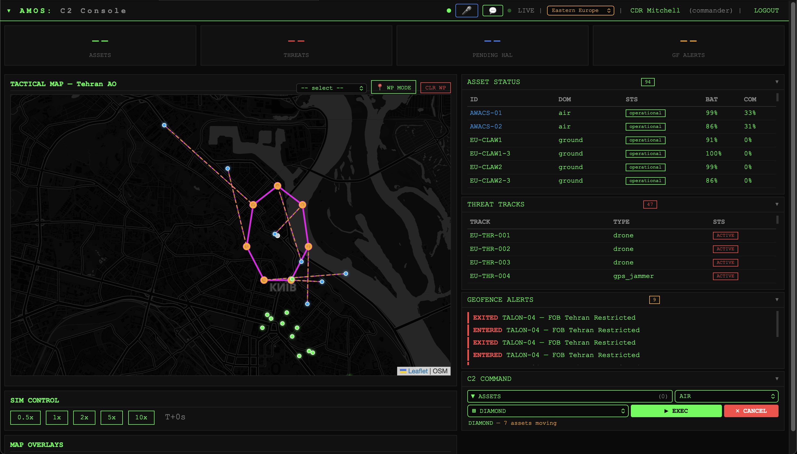
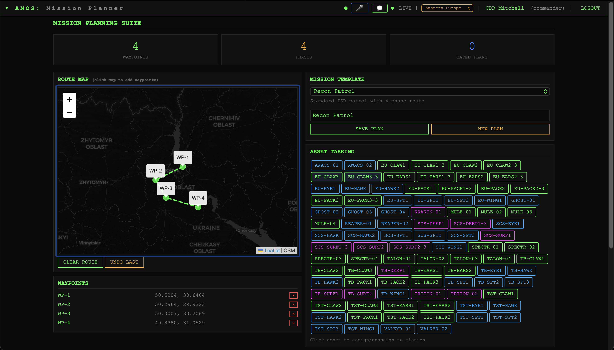
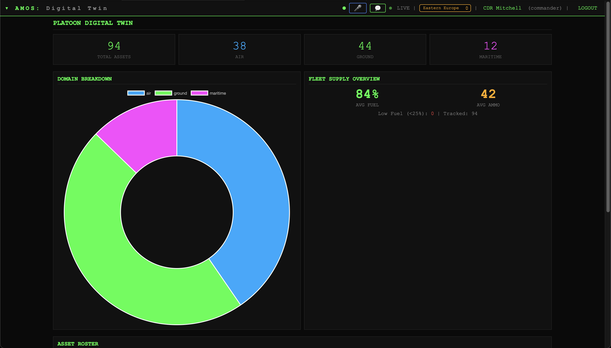
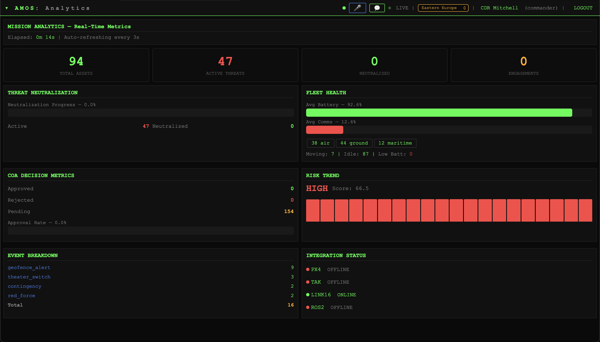
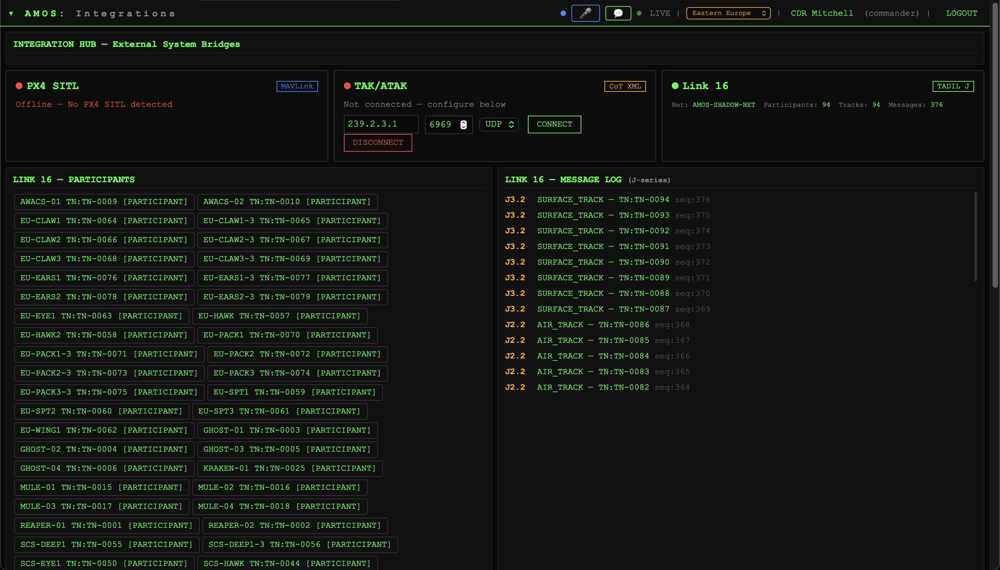
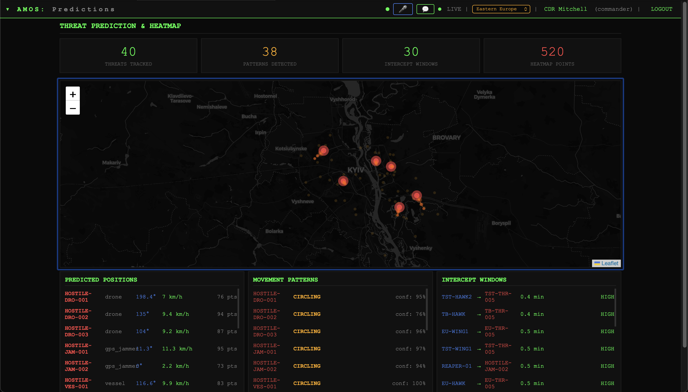
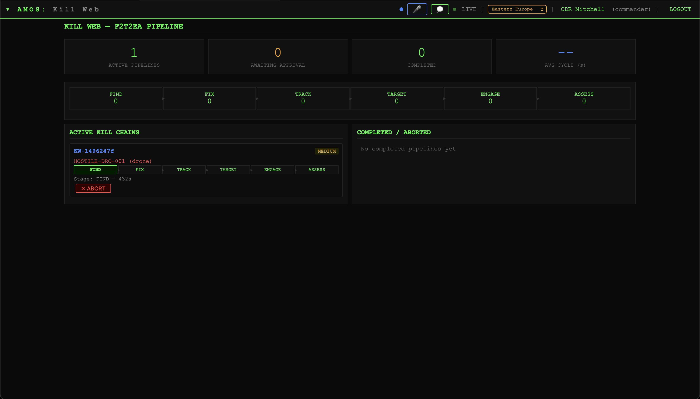
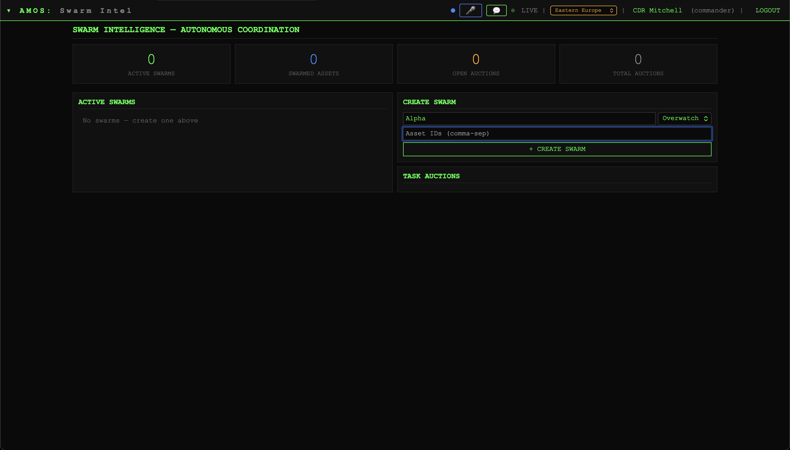
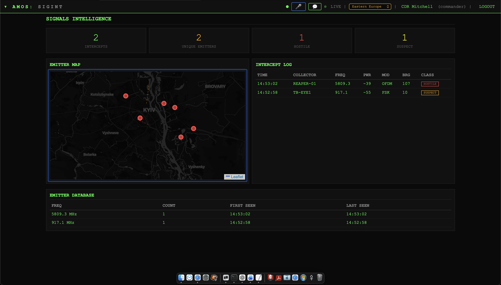
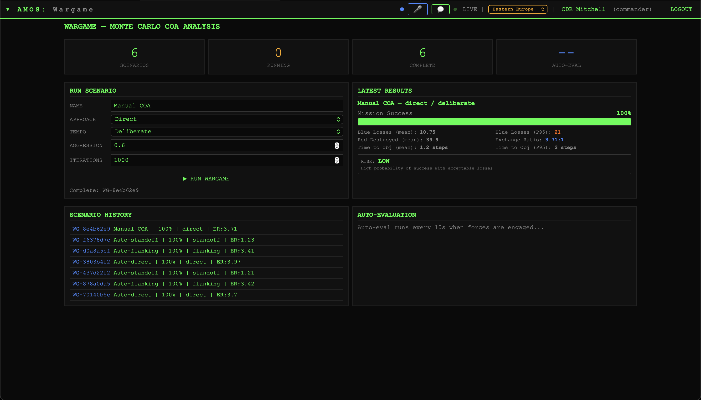

# AMOS — Autonomous Mission Orchestration System

[](LICENSE)
[](https://python.org)
[](tests/)

> *"The LORD roars from Zion … the shepherd watches, and what he sees he declares."*
> — the Book of Amos

In the Bible, **Amos** was a shepherd called to be a watchman — scanning the horizon, seeing threats others missed, and speaking truth when it mattered most. That is exactly what this platform does: it watches across every domain, fuses what it sees, and orchestrates autonomous forces to protect and respond. The name isn't a coincidence.

**Autonomous Mission Orchestration System**

AMOS is a **multi-domain command-and-control platform** that enables small teams of human operators to supervise and coordinate autonomous robotic assets across **air, ground, maritime, cyber, and space domains**.

Instead of controlling individual robots, operators define **mission intent** and AMOS orchestrates assets, sensors, autonomy engines, and communications to execute those missions.

**v0.5.2** — Open Core Release | [**merkuri.one/amos**](https://merkuri.one/amos/)

---

## Run the Demo

Launch a fully simulated autonomous mission with one command:

```bash
git clone https://github.com/merkuriddg/amos-autonomous_mission_orchestration_system.git
cd amos-autonomous_mission_orchestration_system
./run_demo.sh
```

Browser opens automatically. Login: `commander` / `amos_op1` — watch the mission unfold in real time.

**Demo Scenarios:**

- `./run_demo.sh border_patrol` — Sensor network detects border intrusion, drones and ground robots investigate, track, and report *(default)*
- `./run_demo.sh swarm_recon` — Drone swarm deploys into contested zone, adapts to jamming and battery loss, tracks high-value target
- `./run_demo.sh disaster_response` — Earthquake SAR: drones map damage, robots inspect structures, AMOS prioritizes rescue tasks

Each scenario runs ~2 minutes with timed mission events, autonomous coordination, and human-in-the-loop checkpoints.


---

## Platform Overview

<table>
<tr>
<td align="center"><a href="docs/images/mission_console.png"></a><br/><sub><b>Mission Console</b></sub></td>
<td align="center"><a href="docs/images/mission_planning.png"></a><br/><sub><b>Mission Planning</b></sub></td>
<td align="center"><a href="docs/images/simulation.png"></a><br/><sub><b>Simulation</b></sub></td>
<td align="center"><a href="docs/images/telemetry.png"></a><br/><sub><b>Telemetry</b></sub></td>
<td align="center"><a href="docs/images/plugins.png"></a><br/><sub><b>Integrations</b></sub></td>
</tr>
<tr>
<td align="center"><a href="docs/images/predictions.png"></a><br/><sub><b>Threat Predictions</b></sub></td>
<td align="center"><a href="docs/images/killweb.png"></a><br/><sub><b>Kill Web</b></sub></td>
<td align="center"><a href="docs/images/swarm.png"></a><br/><sub><b>Swarm Control</b></sub></td>
<td align="center"><a href="docs/images/sigint.png"></a><br/><sub><b>SIGINT</b></sub></td>
<td align="center"><a href="docs/images/wargame.png"></a><br/><sub><b>Wargaming</b></sub></td>
</tr>
</table>

---

## Why AMOS Exists

Most robotics software focuses on **controlling individual systems**. AMOS focuses on **coordinating autonomous teams**.

- Multi-robot mission orchestration
- Autonomous swarm coordination
- Sensor fusion and autonomous cueing
- Human-machine teaming
- Resilient mesh communications
- Extensible plugin architecture

AMOS acts as the **mission layer between robotics frameworks and operational applications** — integrating mission planning, autonomy orchestration, sensor fusion, wargaming, and resilient networking into a single platform.

---

## Quick Start

```bash
git clone https://github.com/merkuriddg/amos-autonomous_mission_orchestration_system.git
cd amos-autonomous_mission_orchestration_system
python3 -m venv .venv
source .venv/bin/activate
pip install -r requirements.txt
cp .env.example .env
python3 web/app.py
```

Open **http://localhost:2600** — Login: `commander` / `amos_op1`

### Optional: Database Setup

AMOS runs without a database (in-memory mode). For persistent storage:

```bash
bash db/setup.sh              # creates MariaDB database, user, schema, seed data
```

### All Users

| Username | Password | Role | Domain |
|----------|----------|------|--------|
| commander | amos_op1 | Commander | All |
| pilot | wings2026 | Pilot | Air |
| grunt | hooah2026 | Ground Op | Ground |
| sailor | anchor2026 | Maritime Op | Maritime |
| observer | watch2026 | Observer | All |
| field | tactical2026 | Field Op | All |

---

## Editions

AMOS ships in two editions:

- **Open** (`AMOS_EDITION=open`) — Core C2 platform: 200+ API routes, map, assets, threats, EW, SIGINT, cyber, sensor fusion, mesh networking, voice commands, plugin system. Free and open-source.

- **Enterprise** (`AMOS_EDITION=enterprise`) — Full platform: 300+ API routes. Adds cognitive engine, NLP mission parser, Monte Carlo wargaming, swarm intelligence, kill web, ISR/ATR, effects chain, space domain, human-machine teaming, COMSEC, TAK/Link 16/STANAG integrations, and more.

See [ENTERPRISE.md](ENTERPRISE.md) for the full comparison and licensing.

---

## Architecture

```
Applications
  Mission Packs • Analytics • Operator Tools
        ▲
        │
AMOS Platform
  Mission Orchestration • Autonomy Engines • Swarm Coordination
        ▲
        │
Integration Layer
  ROS2 • MAVLink • TAK • MQTT • DDS • Link-16
        ▲
        │
Assets & Sensors
  Drones • Ground Robots • Maritime Vehicles • Satellites
```

```
amos/
├── web/                     — Flask app, routes, templates, simulation engine
├── core/                    — Data model, adapters, COMSEC, geo utilities
├── services/                — 36 autonomous subsystems
├── integrations/            — 21 protocol bridges (see below)
├── examples/                — Demo scenarios + quickstart code samples
│   ├── border_intrusion/    — Border patrol demo
│   ├── swarm_recon/         — Swarm reconnaissance demo
│   ├── disaster_response/   — Earthquake SAR demo
│   └── quickstart/          — "Hello AMOS" API examples (Python + curl)
├── plugins/                 — 15 plugins (adapters, mission packs, examples)
│   ├── adsb_adapter/        — ADS-B aircraft surveillance
│   ├── aprs_adapter/        — APRS amateur radio position tracking
│   ├── atak_adapter/        — ATAK/TAK blue force & CoT
│   ├── ais_adapter/         — AIS maritime vessel tracking
│   ├── dragonos_adapter/    — DragonOS/WarDragon SDR sensor platform
│   ├── meshtastic_adapter/  — Meshtastic/LoRa off-grid mesh
│   ├── px4_adapter/         — PX4 MAVLink autopilot bridge
│   ├── ros2_adapter/        — ROS 2 middleware bridge
│   ├── patrol_mission/      — Patrol mission pack (linear, orbit, sector sweep)
│   ├── search_rescue_mission/ — SAR mission pack (expanding square, parallel track)
│   ├── perimeter_security_mission/ — Perimeter defense (overwatch, tripwire zones)
│   ├── example_sensor/      — Reference sensor plugin
│   └── example_mission_pack/ — Reference mission template
├── sdk/                     — Developer SDK (Python package + docs)
│   ├── python/amos_sdk/     — Installable SDK (contracts, helpers, testing)
│   └── docs/                — Plugin tutorial, contracts ref, integration patterns
├── tools/                   — CLI tools (plugin scaffolding)
├── demo/                    — Legacy demo scenarios
├── db/                      — MariaDB schema + setup script (36 tables)
├── config/                  — Platoon config + theater locations
├── tests/                   — 209 automated tests
└── docs/                    — Architecture, SDK, simulation, API docs
```

---

## Key Capabilities

**Core Platform** — 25 simulated assets (air/ground/maritime), 22 threats, C2 console with Leaflet map, digital twin dashboard, AWACS view, field 3D view, EW/SIGINT/cyber ops, swarm formation control, HAL autonomy engine, voice commands, contested environment simulation

**Kill Chain & Readiness** — F2T2EA kill web with human-approval gate, dynamic ROE posture, AI threat prediction, battle damage assessment, supply logistics

**Wargaming** — 1000+ iteration Monte Carlo simulations, Markov chain attrition modeling, 5 strategies × 3 tempos

**Swarm Intelligence** — Reynolds flocking physics, 6 emergent behaviors, task auction protocol, self-healing formations

**ISR/ATR** — Automatic target recognition, pattern-of-life analysis, change detection, prioritized collection

**Effects Chain** — Multi-domain strike orchestration (Cyber → EW → SIGINT → Kinetic → ISR), 5 pre-built templates

**Space Domain** — 9 orbital assets, Keplerian propagation, SATCOM link budgets, JADC2 mesh

**Human-Machine Teaming** — 5 autonomy levels, trust calibration, workload/fatigue assessment, adaptive delegation

**Mesh Networking** — MANET with 7 frequency bands, Dijkstra routing, frequency hopping, store-and-forward queuing

---

## Documentation

| Guide | Description |
|-------|-------------|
| `/api/docs` | **Interactive Swagger UI** — auto-generated OpenAPI 3.0 docs for all routes |
| `/api/v1/openapi.json` | Machine-readable OpenAPI 3.0 JSON spec |
| `/mobile` | **Mobile / Tablet Field Operator UI** — touch-friendly responsive view |
| `docs/platform/` | System architecture, simulation guide, API versioning |
| `docs/platform/AMOS_Plugin_SDK.md` | Plugin SDK — build asset adapters and integrations |
| `docs/platform/INTEGRATION_GUIDE.md` | Integration bridge development |
| `sdk/docs/PLUGIN_TUTORIAL.md` | Step-by-step plugin building tutorial |
| `sdk/docs/CONTRACTS.md` | Data contract reference (events, types) |
| `sdk/docs/INTEGRATION_PATTERNS.md` | Bridge architecture and patterns |
| `sdk/python/README.md` | SDK quickstart and API reference |
| `docs/hardware/DRAGONOS_SETUP.md` | DragonOS / WarDragon SDR integration guide |
| `ENTERPRISE.md` | Enterprise edition features and licensing |
| `SECURITY.md` | Security policy and vulnerability disclosure |
| `CONTRIBUTING.md` | Contribution guidelines and code style |
| `TRADEMARK.md` | Trademark policy and usage guidelines |

---

## Tech Stack

- **Backend:** Python 3, Flask, Flask-SocketIO
- **Frontend:** Vanilla JS, Leaflet.js, CesiumJS, WebSocket
- **Database:** MariaDB (optional — runs in-memory without it)
- **Testing:** pytest (209 tests), GitHub Actions CI (Python 3.11 + 3.12)
- **Integrations:** MAVLink, CoT XML, TADIL J, ROS 2, MQTT, DDS, Kafka, VMF, STANAG 4586, ADS-B, APRS, AIS, RemoteID, LoRa/Meshtastic, NMEA, DragonOS/WarDragon SDR
- **Security:** AES-256-GCM encryption, HMAC, key lifecycle management

## Testing

```bash
python3 -m pytest tests/ -v --tb=short
```

209 tests across route, service, and contract layers. CI runs on every push via GitHub Actions.

## Plugin Development

Build your own AMOS plugins with the scaffolding tool:

```bash
python3 tools/create_plugin.py my_sensor --type sensor_adapter
```

Supports 6 plugin types: `asset_adapter`, `sensor_adapter`, `mission_pack`, `planner`, `analytics`, `transport`

See the [Plugin Tutorial](sdk/docs/PLUGIN_TUTORIAL.md) for a step-by-step guide, or browse `plugins/example_sensor/` for a reference implementation.

The SDK also provides typed data contracts and a test harness:

```bash
pip install -e sdk/python     # install AMOS SDK locally
```

```python
from amos_sdk import PluginBase, SensorReading
from amos_sdk.testing import PluginTestHarness
```

See [SDK README](sdk/python/README.md) and [Data Contracts](sdk/docs/CONTRACTS.md) for full reference.

---

## License

AMOS Open Core is free and open source under the [Apache License 2.0](LICENSE).

Enterprise modules are available under commercial license from Merkuri LLC. See [ENTERPRISE.md](ENTERPRISE.md).

## Trademark

AMOS™ and Autonomous Mission Orchestration System™ are trademarks of Merkuri LLC. Use of these names in commercial products or services requires written permission. See [TRADEMARK.md](TRADEMARK.md) for the full policy.

All contributions grant Merkuri LLC rights to use contributions commercially.

## Security

**AMOS is a research and development platform.** See [SECURITY.md](SECURITY.md).

---

## Get Involved

AMOS is built for the robotics, defense, and autonomous systems community. Here's how to contribute:

- **Build a plugin** — Use `tools/create_plugin.py` to scaffold a new asset adapter, sensor, or mission pack
- **Add an integration** — Connect a new protocol or hardware platform (see `integrations/` for examples)
- **Improve docs** — Tutorials, API examples, deployment guides
- **Write tests** — Expand coverage across route, service, and contract layers
- **Try a demo** — Run `./run_demo.sh` and explore the platform

See [CONTRIBUTING.md](CONTRIBUTING.md) for guidelines.

---

## Vision

Autonomous systems are rapidly evolving, but they remain fragmented. AMOS provides the **mission operating system that allows autonomous systems to operate as coordinated teams**.
